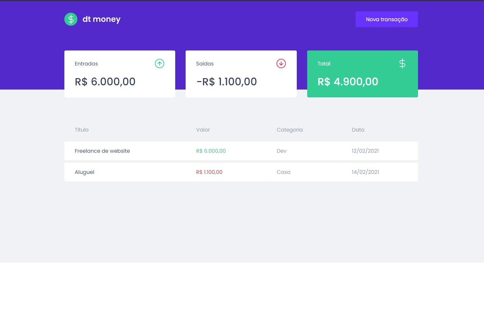

# dtmoney

<p align="center">
  
       
  

</p>

<br />

<div align="center">
    
</div>

<br>

## Tecnologias

Esse projeto foi desenvolvido com:

- [React](https://reactjs.org)
- [TypeScript](https://www.typescriptlang.org)

## Execução do projeto

Clone o projeto e acesse a pasta do mesmo.

```bash
$ git clone https://github.com/lucasggmc/dtmoney
$ cd dtmoney
```

Para iniciar, siga os passos abaixo:
```bash
# Instalar todas as dependências do projeto
$ yarn

# Iniciar o projeto
$ yarn start
```
Se tudo correr bem o app estará disponível no seu browser pelo endereço http://localhost:3000 ou por outra porta indicada pela própria aplicação :D
